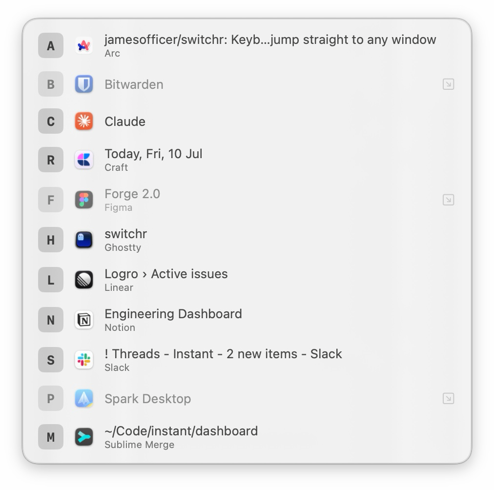
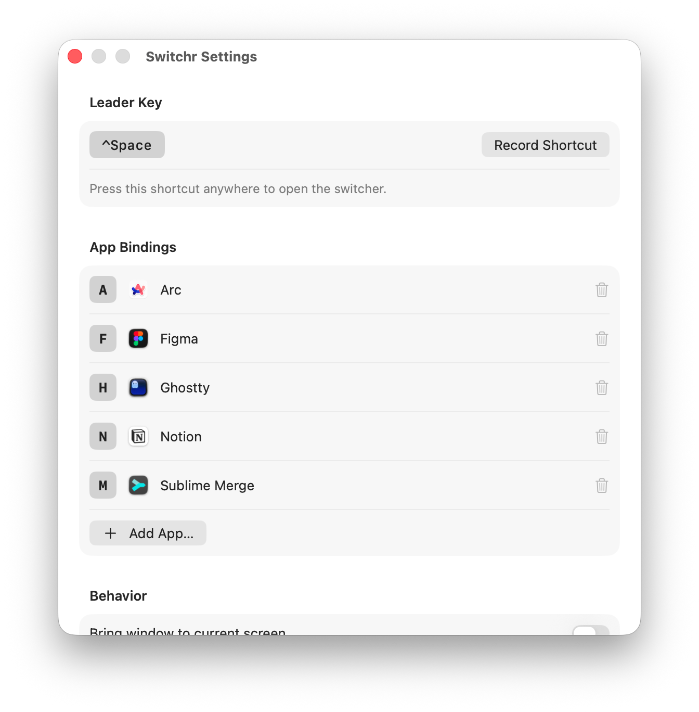

<p align="center">
  
</p>

<h1 align="center">Switchr</h1>

<p align="center">
  Keyboard-driven window switcher for macOS.<br>
  Press a leader key, then a letter, to jump straight to any window.
</p>

---

Switchr lives in your menu bar. Hit the leader key (⌃Space by default) and a Spotlight-style panel lists every open window, each with a letter. Press the letter and you're there — no cycling through ⌘Tab, no hunting through Mission Control.

## Screenshots

| Switcher | Settings |
| --- | --- |
|  |  |

## Features

- **Stable letters** — each app keeps the same letter across launches (Safari is always `S`), and extra windows of the same app keep their own letters for as long as they're open, so switching between two browser windows never swaps their keys.
- **Custom bindings** — pin a specific key to a specific app in Settings; automatic assignment can never steal it.
- **Configurable leader key** — record any combination that includes ⌃, ⌥ or ⌘.
- **Bring window to current screen** *(optional)* — on multi-monitor setups, focusing a window can move it to the screen you're looking at, keeping its relative position.
- **Maximize when focused** *(optional)* — resizes the focused window edge to edge (a normal resize, not macOS full screen).
- **Fast and unobtrusive** — a non-activating panel, so dismissing it (Esc or the leader key again) drops you right back where you were. Menu bar only, no Dock icon. Minimized windows are restored when selected.

## Installation

Switchr isn't distributed pre-built yet, so you build it from source:

```sh
git clone https://github.com/jamesofficer/switchr.git
cd switchr
xcodebuild -project switchr.xcodeproj -scheme switchr -configuration Release build
cp -R ~/Library/Developer/Xcode/DerivedData/switchr-*/Build/Products/Release/Switchr.app /Applications/
open /Applications/Switchr.app
```

On first launch, grant **Accessibility** access when prompted (System Settings → Privacy & Security → Accessibility). Switchr needs it to list and focus other apps' windows — that's all it's used for.

### Requirements

- macOS 26.4 or later
- Xcode (to build)

## Usage

| Action | Keys |
| --- | --- |
| Open the switcher | ⌃Space (configurable) |
| Focus a window | its letter |
| Dismiss | Esc, or ⌃Space again |

Settings are in the menu bar icon → **Settings…**, covering the leader key, per-app bindings, and the behavior toggles above.
